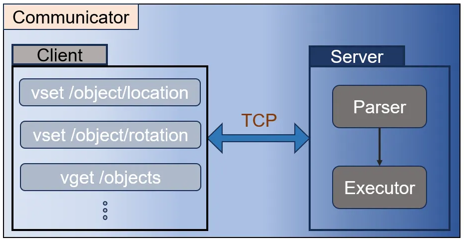

Communicator
===========

The **Communicator** module serves as the bridge between Python-based simulation logic and Unreal Engine's real-time 3D environment. Implemented in both Python and C++, it uses **UnrealCV** to establish a TCP connection, enabling asynchronous communication between the two sides.

We extended the basic communication protocol by defining a custom set of commands for scene control, actor manipulation, and data querying. These commands are encoded in JSON format and passed through the TCP channel. For instance, Python can instruct UE to spawn an actor at a specific location, retrieve the current pose of a pedestrian, or trigger motion events on a robot.

The Communicator plays a central role in the simulation loop: Python uses it to update the virtual world, while UE reports back environmental feedback or visual state. This design allows us to decouple logic computation from rendering, achieving both flexibility and modularity.

