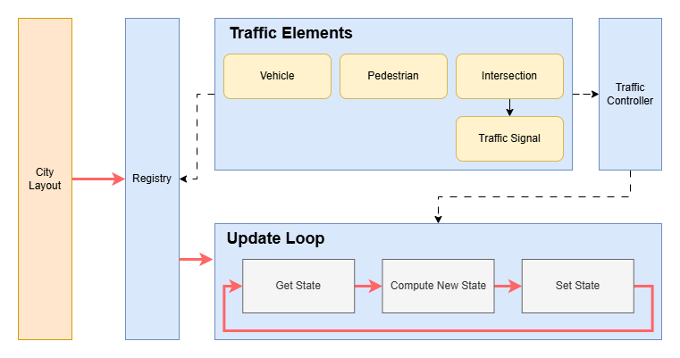

Traffic System
===============

Overview
--------

.. image:: ../assets/traffic_overview.png
    :alt: Traffic System Overview
    :width: 800px
    :align: center

The traffic system is a core component of our simulator,responsible for simulating dynamic road
usage by both vehicles and pedestrians.It enables the representation of realistic traffic flow,
including vehicle generation, path planning, intersection control, and pedestrian behavior. By
managing road interactions and traffic signals,this system supports complex urban scenarios such as
congestion, pedestrian crossings, and traffic light coordination, providing a critical foundation for
evaluating urban infrastructure and mobility policies.

The traffic system operates on a city layout graph provided by the CLPG (City Layout Procedural Generator),
esigned to support traffic simulation for any city layout. Based on the road network extracted from CLPG,
the system constructs detailed traffic routes, including traffic lanes, sidewalks, crosswalks. These
routes serve as the foundation for all dynamic traffic simulation components.

After establishing the route network, three managers handle populating the traffic elements:

- The **VehicleManager** samples positions along the traffic lanes to spawn vehicles, assigning them
- predefined or dynamically generated routes through the network.
- The **PedestrianManager** places pedestrians along sidewalks and controls their movement patterns,
- including crossing decisions at intersections.
- The **IntersectionManager** identifies intersections within the route network and installs traffic
- signal agents that control the right-of-way based on configurable timing policies or adaptive logic.

Together, these components form a fully functional traffic simulation pipeline, allowing the virtual
city to support realistic and reactive mobility behavior.

Architecture
------------

The traffic system adopts a modular architecture centered around a top-level `TrafficController`, which
coordinates the behavior of three specialized managers: `VehicleManager`, `IntersectionManager`, and `PedestrianManager`.

To enable real-time simulation, the system integrates with Unreal Engine through a `Communicator` module,
which provides bidirectional communication between the traffic logic and the simulation environment. This
allows the system to send control signals and receive state updates from virtual actors within the engine.

Base Class
~~~~~~~~~~

The traffic system is composed of several modular components that collectively simulate realistic urban mobility. The system is initialized based on a **Road Network**, which provides the geometric and topological structure of the city. 

- **Traffic Network Generator**: This module constructs the simulation-ready traffic network from the road layout. It generates essential components including **Traffic Lanes** for vehicles, **Sidewalks** for pedestrians, and **Crosswalks** for pedestrian-vehicle interactions at intersections.
- **Traffic Controller**: Acting as the central coordinator, this module manages the initialization and runtime orchestration of all traffic-related components. It interfaces with the **Communicator** to synchronize with the Unreal Engine, enabling real-time bidirectional updates.
- **Vehicle Manager**: This component samples spawn points along the traffic lanes to instantiate and manage **Vehicles**. It governs routing, movement, and state updates in coordination with the traffic controller and PID logic.
- **Pedestrian Manager**: Responsible for spawning **Pedestrians** on sidewalks and controlling their navigation, especially when interacting with crosswalks and intersection logic.
- **Intersection Manager**: Identifies and manages **Intersections** in the traffic network. It places and controls **Traffic Signals** to regulate vehicle and pedestrian flow based on predefined or adaptive timing schemes.
- **PID Controller**: A low-level control module responsible for computing continuous control signals (e.g., turning) for vehicles, ensuring smooth movement and realistic behavior along generated paths.

Extensibility
-------------

The modular design of the traffic system ensures high extensibility and adaptability across diverse simulation scenarios. Each core component operates independently with well-defined interfaces, allowing new functionalities to be integrated with minimal disruption. Here are several customizable elements: 

- City layout: The traffic system can simulate any city layout that follows the specified input format.
- Vehicle control algorithm: The current system uses PID control for vehicles, but users can implement their own algorithms by replacing the PID Controller module.
- Pedestrian behavior: While pedestrians currently follow basic street rules, users can integrate more sophisticated behavior models to create a more realistic social environment.
- Traffic signals: Traffic signals currently operate on configurable fixed timing intervals. The system supports plug-in logic for adaptive or learning-based traffic signal control strategies.