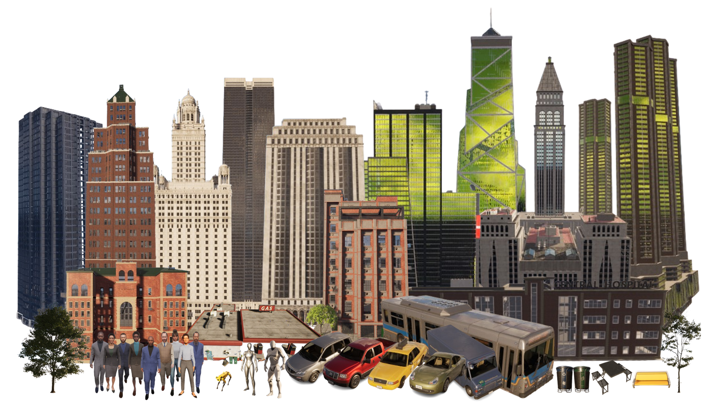

# Unreal Engine Integration

## Assets

Our simulator provides a rich collection of city-scale assets, designed to support realistic and diverse urban simulations. These assets include buildings, trees, street furniture, vehicles, pedestrians, and robots. All assets are sourced from the Unreal Engine Marketplace to ensure high visual fidelity and performance.

In addition to the curated asset library, we also offer an **Asset Generation Pipeline** that enables users to create `.uasset` files directly from natural language descriptions. This tool streamlines the content creation process by converting user prompts into usable Unreal Engine assets, significantly lowering the barrier for customizing city environments.

### Collected Assets

Below is a selection of the assets currently available in our simulator:

* **Buildings**: A variety of architectural styles, including residential, commercial, and industrial structures.
* **Trees**: Multiple tree species with seasonal variations to enhance environmental realism.
* **Street Furniture**: Items such as benches, streetlights, mailboxes, and trash bins to add detail and immersion.
* **Vehicles**: A range of vehicles including cars, buses, trucks, and scooters, each with accurate scale and animations.
* **Pedestrians**: Human characters with diverse appearances and animations to simulate crowd behavior.
* **Robots**: Different types of mobile robots for testing autonomous navigation and interaction. Including humanoid, robot dog, etc.

These assets collectively enable the creation of complex, dynamic, and realistic city scenes for simulation, visualization, and research purposes.

### Asset Generation Pipeline

Our **Asset Generation Pipeline** enables the automatic generation of 3D assets from natural language descriptions. This tool is currently designed for developers and is intended to be used within the Unreal Engine Editor. By translating descriptive text into `.uasset` files, this pipeline significantly accelerates asset creation, making it easier to populate large-scale environments with customized elements.

## Motions

To enhance realism and interactivity in the simulation, we provide a comprehensive set of **motion animations**, with a strong focus on animations for pedestrians and robots. These motions are essential for simulating lifelike behaviors such as walking, running, waving, interacting with objects, and more.

All motion assets are sourced from the Unreal Engine Marketplace to ensure quality and compatibility. In addition, we offer a **Text-to-Motion Pipeline** that allows developers to generate animation sequences directly from natural language inputs. This supports rapid prototyping and experimentation with custom behaviors.

### Collected Motions

Here are some examples of motion animations included in the simulator:

* Walking, jogging, turning, idling, interacting with street furniture, Group conversations, pedestrian-vehicle yielding, and gesture-based communication, etc.

### Text-to-Motion Pipeline

The **Text-to-Motion Pipeline** enables developers to describe a desired motion in natural language (e.g., "a robot turns around and waves") and generate a corresponding animation sequence. This tool is ideal for rapidly prototyping behaviors, simulating dynamic environments, and enriching scenario design without manual animation editing.