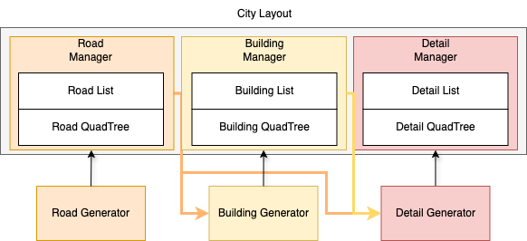
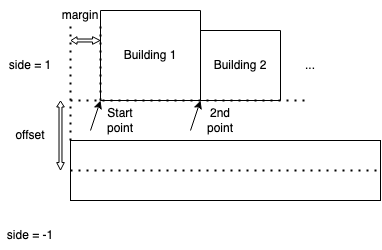

City Layout Procedural Generation
==================================

The City Layout Procedural Generation (CLPG) module is a key component of the SimWorld simulator, responsible for generating realistic city layouts from simple input specifications. This module provides a flexible and extensible framework for creating diverse urban environments that can be used for various embodied AI tasks.

Data Structure
--------------

A city layout contains many different types of elements. While it's impractical to catalog every possible item in a city, we can simplify our understanding by grouping all items into **4** main categories:

+------------+-------------+-------------+------------+-----+
| **Road**   | Highway    | Normal way  | Small roads| ... |
+------------+-------------+-------------+------------+-----+
| **Building**| Hospital   | Landmark    | School     | ... |
+------------+-------------+-------------+------------+-----+
| **Detail** | Tree       | Bone        | Parking cars| ... |
+------------+-------------+-------------+------------+-----+
| **Actor**  | Cars on the road | Pedestrian | Agent   | ... |
+------------+-------------+-------------+------------+-----+

Procedural Generation
---------------------

Procedural generation is a fundamental method for creating city layouts that resemble the real world. Using this approach, all items in the generated world follow specific rules and constraints. These constraints control how different items are distributed, ensuring the city layout appears organized rather than random. 

Code Structure
~~~~~~~~~~~~~~

The city generator includes three managers: Road, Building, and Detail. Each manager contains list and quadtree data structures to store item information. QuadTree provides fast methods for searching space-related information, such as nearby objects. Lists offer a convenient way to iterate through items. 

Generators contain various algorithms for generating and sampling candidate positions for items while handling overlapping situations. They offer constraints and rules of generation.

The Road manager serves as the foundation for the city, followed by the Building manager. The Detail manager generates content based on data from the Road and Building managers through the generator.

Generation Process
~~~~~~~~~~~~~~~~~~

There are 4 stages of generation process: road generation, building generation, detail generation and data generation

Road
::::

Road generation consists of two sub-stages: initiation and road-tree growth.

- Initiation

In the initiation stage, the program reads the config file, focusing on the road length and initial road count. It then spawns the first one or two roads on the map, which by default have a constant length as specified in the config and a 0-degree angle with the x-axis.

- Road-Tree growth

Using the initial road(s) as a foundation, we generate additional roads through a tree-like growth structure.

To balance the road tree's depth and branch numbers, we use a Priority Queue instead of simple DFS or BFS iteration algorithms. The Priority Queue, implemented as a tree structure, helps select growth nodes from the generated road tree. This approach creates a road map with balanced branches and depth, better resembling real city or town road layouts.

During generation, we handle two special cases: closely spaced road endpoints and intersecting road segments.

- Road end attachment

During generation, when a newly generated road endpoint is very close to an existing node, it creates an unsightly gap. In such cases, we attach the new node to the existing one, eliminating gaps while creating more diverse road lengths.

- Cross check

Despite the attachment mechanism, road intersections can still occur. We perform additional intersection checks during generation. If any roads intersect, we remove the most recently generated one.

Building
::::::::

Building generation is based on the generated road maps. From a list of roads, we select one road segment and generate buildings along both sides. For each side, the generation process has two stages: normal generation and final building placement. The main goal is to create a uniform distribution of different building types while maximizing space utilization on the map.

- Normal generation

A pointer tracks the current position for candidate buildings. During generation, the pointer's position updates based on the building size and road angle. The pseudo code for pointer updates is shown as follows:

.. code-block:: python
   # Pseudo code for pointer updates
   pointer_position = road_start * side * offset + margin_distance
   while pointer_position < road_end * side * offset - margin_distance:
      pointer_position += building_size * angle

In each iteration, we randomly select a building type from the building database and check if it can be placed at the current position without overlapping with roads or other buildings.

- The last building on the road

When the pointer approaches the road's end, most candidate buildings may not fit the remaining space. To fill this gap efficiently, we greedily select buildings from largest to smallest until one fits. After placement, we update the pointer's position and continue to the next iteration. Only when no building can fit in the remaining road space do we move to the other side of the road or the next road segment.

Details
:::::::

Details refer to the smaller objects in a city, including trees, road cones, chairs, tables, scooters, and other items. These objects are distributed throughout every corner of the city. To simplify their generation process, we use two different approaches: details surrounding buildings and details along roads. Note that we don't consider collisions between details and other objects—we only check if positions are accessible. This is a practical trade-off between computational efficiency and visual effect, given the large number of details.

- Details surround building
    
    For each building, we sample a constant number of detail positions within a suitable range. We then check whether these candidate positions are available, since some may be in the middle of roads or inside other buildings. The sampling area consists of two rectangular zones, excluding the side closest to the road.
    
    .. image:: assets/clpg_detail_1.png
       :alt: Details Surround Building
       :width: 800px
       :align: center
    
- Details spline road
    
    Along the roads, we divide the sidewalk area into different functional parts: vegetation, random objects, and parking areas. We generate different types of detail items according to each area. The density of items varies by area, offering greater customization and creating a cleaner, more suitable sidewalk appearance.Three functional parts are divided by distance from the road's middle line:
    
    .. image:: assets/clpg_detail_2.png
       :alt: Details Spline Road
       :width: 800px
       :align: center
    

Interface
---------

We also have a user-friendly interface that supports manual design and modification of city layouts. Users can add new buildings, set their positions through mouse dragging, and move existing buildings.

API
---

While rule-based generation creates realistic results, it limits layout diversity. Therefore, we provide function calling capabilities that allow LLMs to easily create and modify layouts. Assuming we have a VLM/LLM that can understand the abstract structure of city layouts—including tree distribution, road maps, benches, and building placement—it can use our tool to simulate a city in UE based on its understanding.

Function calls include the following capabilities:

+------------------------+----------------------------+-----------------------------------------------+-------------------+
| **Function Name**       | **Purpose**                | **Parameters**                                | **Return**        |
+------------------------+----------------------------+-----------------------------------------------+-------------------+
| AddRoad                | Create a new road segment  | start_pos (Vector2), end_pos (Vector2), road_type (enum) | road_id          |
+------------------------+----------------------------+-----------------------------------------------+-------------------+
| RemoveRoad             | Delete existing road       | road_id                                       | bool success      |
+------------------------+----------------------------+-----------------------------------------------+-------------------+
| ModifyRoad             | Update road properties     | road_id, new_start_pos (optional), new_end_pos (optional), new_type (optional) | bool success      |
+------------------------+----------------------------+-----------------------------------------------+-------------------+
| QueryRoadNearby        | Find roads within radius   | position (Vector2), radius (float)            | List[road_id]     |
+------------------------+----------------------------+-----------------------------------------------+-------------------+
| AddBuilding            | Place new building         | position (Vector2), rotation (float), building_type (enum) | building_id      |
+------------------------+----------------------------+-----------------------------------------------+-------------------+
| RemoveBuilding         | Delete existing building   | building_id                                   | bool success      |
+------------------------+----------------------------+-----------------------------------------------+-------------------+
| ModifyBuilding         | Update building properties | building_id, new_position (optional), new_rotation (optional) | bool success      |
+------------------------+----------------------------+-----------------------------------------------+-------------------+
| QueryBuildingNearby    | Find buildings within radius | position (Vector2), radius (float)           | List[building_id] |
+------------------------+----------------------------+-----------------------------------------------+-------------------+
| AddDetail              | Place detail object        | position (Vector2), detail_type (enum), parent_id (optional) | detail_id        |
+------------------------+----------------------------+-----------------------------------------------+-------------------+
| RemoveDetail           | Delete existing detail     | detail_id                                     | bool success      |
+------------------------+----------------------------+-----------------------------------------------+-------------------+
| ModifyDetail           | Update detail properties   | detail_id, new_position (optional), new_type (optional) | bool success      |
+------------------------+----------------------------+-----------------------------------------------+-------------------+
| QueryDetailNearby      | Find details within radius | position (Vector2), radius (float)            | List[detail_id]   |
+------------------------+----------------------------+-----------------------------------------------+-------------------+
| GenerateRoadNetwork    | Auto-generate road layout  | seed (int), config_file_path (string)         | bool success      |
+------------------------+----------------------------+-----------------------------------------------+-------------------+
| GenerateBuildingsAlongRoad | Auto-place buildings along road | road_id, config_file_path (string)       | List[building_id] |
+------------------------+----------------------------+-----------------------------------------------+-------------------+
| GenerateDetailsAroundBuilding | Auto-place details near building | building_id, detail_density (float)     | List[detail_id]   |
+------------------------+----------------------------+-----------------------------------------------+-------------------+
| GenerateRoadSideDetails | Auto-place details along road | road_id, detail_types (List[enum])          | List[detail_id]   |
+------------------------+----------------------------+-----------------------------------------------+-------------------+

All functions return appropriate error codes and messages when operations fail (e.g., invalid positions, overlapping objects, etc).